# DOCUMENTATION TECHNIQUE DE TERRAOHADA

## 📖 1. Vue d'Ensemble

**TerraOhada** répond à un besoin clair : rendre le droit OHADA accessible, compréhensible et exploitable. Dans un environnement où l’accès à l’information juridique reste souvent complexe, dispersé ou inégal, la plateforme centralise les contenus clés : textes, décisions, résumés, commentaires dans une interface claire et fonctionnelle.
Accessible depuis tous les pays membres de l’OHADA, et bien au-delà, **TerraOhada** s’adresse à tous ceux qui travaillent avec le droit des affaires africain, ou s’y intéressent

### **Pour qui est Terraohada :**

**1. Professionnels du droit OHADA**  
La plateforme s’adresse à tous les praticiens du droit en Afrique francophone : avocats, juristes d’entreprise, notaires, magistrats, greffiers, experts-comptables ou fiscalistes. Elle leur permet d’accéder rapidement à des contenus fiables liés au droit OHADA, pour renforcer leur veille juridique et faciliter leur travail quotidien.

**2. Étudiants en droit et en spécialisation OHADA**  
Pensée comme un outil d’accompagnement, la solution offre aux étudiants un accès simplifié aux textes juridiques, jurisprudences et ressources essentielles à la compréhension du droit des affaires africain. Elle soutient leur apprentissage et leurs recherches dès les premières années d’étude.

**3. Enseignants-chercheurs et experts en droit des affaires africain**  
Les universitaires, doctorants et passionnés du droit OHADA peuvent s’appuyer sur la plateforme pour enrichir leurs travaux de recherche, préparer leurs cours ou partager des références. L’outil facilite l’accès aux sources, dans une logique de vulgarisation et de diffusion du savoir.

**4. Entreprises, institutions et ONG opérant dans l’espace OHADA**  
Dans un environnement où la sécurité juridique est cruciale, notre solution permet aux organisations implantées dans les 17 États membres de mieux comprendre le cadre légal unifié de l’OHADA. Elle constitue un point d’entrée fiable pour appuyer les équipes internes ou les partenaires juridiques.

**5. Cabinets de recrutement et structures RH juridiques (bientôt disponible)**  
À mesure que la plateforme évolue, elle intégrera des fonctionnalités à forte valeur ajoutée pour les cabinets spécialisés dans le recrutement juridique en Afrique. Bien que la mise en relation directe ne soit pas encore disponible, la plateforme pose les bases d’un écosystème juridique connecté, à suivre de près.

### Pourquoi choisir TerraOhada ?

TerraOhada, c'est bien plus qu'une base de données juridiques. C'est un véritable écosystème conçu pour faciliter l'accès au droit OHADA.

1.  Interface claire et moderne
2.  Gain de temps significatif
3.  Information fiable et continue
4.  Conçue en Afrique, pour l'Afrique
5.  Démarche collaborative

### Fonctionnalités Clés de TerraOhada

#### 1- Annuaire OHADA des professionnels(en cours de développement)

Boostez votre **visibilité**, **crédibilité** et **réseau** avec notre annuaire dédié.

**Pour les professionnels** : valorisez votre expertise, développez votre clientèle et connectez vous à un écosystème qualifié.

**Pour les particuliers et entreprises** : trouvez rapidement un professionnel selon sa spécialité, son pays ou sa juridiction, et entrez facilement en contact.

#### 2- Base juridique Ohada

Tapez un mot-clé, un pays, une juridiction ou un thème.

#### 3- Espace personnel sécurisé

Historique de recherches et contenus favoris.

#### 4- Job board juridique (bientôt disponible)

Accédez à des offres d’emploi, de stage ou de collaboration dans le domaine juridique en Afrique. Mettez en relation recruteurs et candidats qualifiés.

#### 5- Quizz juridiques interactifs

Testez vos connaissances sur le droit OHADA grâce à des quiz ludiques et pédagogiques conçus pour les étudiants et jeunes professionnels.

---

**État du projet** : 📍MVP 1 (TEST)

**Lien vers l'application** : https://mvp-terraohada-frontend.vercel.app

**Dépôt GitHub** : https://github.com/terraOhada/projet_terraOhada (Privé)

---

## 🏗 2. Stack Technique & Architecture

### **Stack Utilisé**

- **Frontend :** React 18+, TypeScript, Zustand, Tanstack Query Tailwind CSS, Vite

- **Backend :** Node.js, Express.js,
- **Base de Données :** MongoDB (avec Prisma ORM) , Notion (Pour les Juristes) & Excel (Pour les quizz)
- **Authentification :** JWT (JSON Web Tokens)
- **Hébergement :** Frontend sur Vercel, Backend & DB sur Render
- **Autres Services :** Cloudinary (stockage d'images), Flutterwave(Paiement, Abonnement)

### **Architecture**

Le projet suit une architecture client-serveur (API REST).

```mermaid
graph LR
    A[Navigateur Client] --> B[Frontend React<br/>TypeScript, Vite<br/>Hébergé sur Vercel];
    B --> C[Backend API Express.js<br/>Node.js<br/>Hébergé sur Render];
    C --> E[(MongoDB<br/>avec Prisma)];
    C --> F[Cloudinary];
    C --> G[Flutterwave];
    C --> H[(Notion API)];
    C --> I[(Fichiers Excel)];
```



## 3. 🚀 Démarrage Rapide (Développement Local)

#### **Prérequis**

Assurez-vous d'avoir installé sur votre machine :

- Node.js (v18 ou supérieure)
- npm ou yarn

#### **Instructions d'Installation**

1.  **Cloner le dépôt et installer les dépendances**

```markdown
git clone https://github.com/terraOhada/projet_terraOhada.git
cd projet_terraOhada

# Installer les dépendances du backend

cd backend && npm install

# Installer les dépendances du frontend

cd ../frontend && npm install
```

2. **Configuration de l'Environnement**

- Backend : Copiez `backend/.env.example` vers `backend/.env` et renseignez les variables.
- Frontend : Copiez `frontend/.env.example` vers `frontend/.env.local` et renseignez les variables.  
  _Variables clés à définir :_

```
# backend/.env

# Basic
DATABASE_URL=""
JWT_SECRET=
PORT=5000
NODE_ENV=development
CORS_ORIGIN=http://localhost:5173
FRONTEND_URL=https://mvp-terraohada-frontend.vercel.app

# Brevo SMTP
SMTP_USER=
SMTP_PASSWORD=
SENDER_EMAIL="example@gmail.com"

# Cloudinary keys
CLOUDINARY_CLOUD_NAME=
CLOUDINARY_API_KEY=
CLOUDINARY_API_SECRET=

# Notion keys
NOTION_API_KEY=
NOTION_DATABASE_ID=

# Flutterwave test keys
FLW_PUBLIC_KEY=
FLW_SECRET_KEY=
FLW_ENCRYPTION_KEY=
FLW_REDIRECT_URL=http://localhost:5173/payment-callback

---
# frontend/.env.local
VITE_NODE_ENV=development
VITE_API_BASE_URL=http://localhost:5000/api
```

3. **Initialiser la Base de Données**

```
cd backend
npx prisma generate
npx prisma db push
npm run seed # (Optionnel) Peuple la DB avec des données de test
```

4.  **Lancer les Services**

    - **Lancer le backend :** `cd backend && npm run dev`
    - **Lancer le frontend :** `cd frontend && npm run dev`
    - L'application sera accessible sur `http://localhost:5173` et l'API sur `http://localhost:5000`.

## 4. **📁 Structure du Projet**

Le projet est organisé en deux dossiers principaux : `backend` et `frontend`, suivant une architecture monorepo.

#### **Backend (Node.js + Express)**

```
backend/
├── prisma/                 # Schémas et migrations de la base de données
├── src/
│   ├── config/            # Fichiers de configuration (DB, cloud, etc.)
│   ├── controllers/       # Contrôleurs - Logique métier des routes
│   ├── generated/         # Fichiers générés (probablement par Prisma)
│   ├── middleware/        # Middlewares Express (auth, validation, etc.)
│   ├── nodemailer/        # Configuration et templates d'emails
│   ├── routes/            # Définitions des routes de l'API
│   ├── scripts/           # Scripts utilitaires (migrations, seeds, etc.)
│   ├── services/          # Services métier et logique complexe
│   ├── utils/             # Fonctions utilitaires (helpers)
│   └── index.js           # Point d'entrée de l'application
├── temp/                  # Dossier de fichiers temporaires
├── uploads/               # Dossier de stockage des uploads
├── .env                   # Variables d'environnement (NE PAS VERSIONNER)
├── .gitignore            # Fichiers ignorés par Git
├── package.json          # Dépendances et scripts du backend
└── vercel.json           # Configuration du déploiement sur Vercel
```

#### **Frontend (React + TypeScript + Vite)**

```
frontend/
├── public/                # Fichiers statiques (icônes, images publics)
├── src/
│   ├── api/              # Configurations et fonctions pour appels API
│   ├── assets/           # Assets (images, fonts) importés dans le code
│   ├── components/       # Composants React réutilisables
│   ├── data/             # Données statiques (ex: options de filtres)
│   ├── hooks/            # Hooks React personnalisés
│   ├── layout/           # Composants de layout (Header, Footer, Sidebar)
│   ├── pages/            # Composants de pages / vues
│   ├── query/            # Configuration TanStack Query
│   ├── store/            # Configuration Zustand (état global)
│   ├── types/            # Définitions TypeScript
│   ├── utils/            # Fonctions utilitaires
│   ├── App.tsx           # Composant racine de l'application
│   ├── index.css         # Styles globaux
│   └── main.tsx          # Point d'entrée de l'app React
├── env/                  # Variables d'environnement (?)
├── index.html            # Template HTML principal
├── package.json          # Dépendances et scripts du frontend
└── eslint.config.js      # Configuration ESLint pour le linting
```

## 6. 🤝 Guide de Contribution

1.  **Créer une branche** à partir de `develop` : `git checkout -b feat/nouvelle-fonctionnalite`
2.  **Respectez les conventions de code** : Le projet utilise ESLint et Prettier. Exécutez `npm run lint` avant de committer.
3.  **Testez vos modifications**.
4.  **Poussez votre branche** et ouvrez une **Pull Request** vers `develop`.
5.  Assurez-vous que tous les checks CI (tests, lint) passent.

## 7. 🚀 Déploiement

Le déploiement est entièrement automatisé via GitHub Actions :

- **Branche `main`** : Un push déclenche un déploiement automatique en **production** (sur Vercel & Render).
- **Branche `develop`** : Un push déclenche un déploiement automatique en **environnement de staging** (URL de preview).

Les variables d'environnement sont gérées directement sur les plateformes d'hébergement (Vercel & Render).
